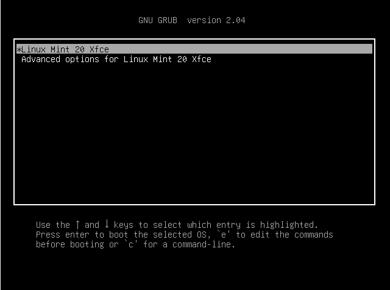

# Stage 2: Bootloader
2.Bootloader

The MBR is loaded into ram which is referred to as the boot-loader (eg. GRUB)

The CPU will then jump to the bootloader in RAM

The Bootloader is executed 

The bootloader will be able to interact with file structures and partitions

The bootloader will access a .cfg file which contains all menu entry's about which partition has which OS on it and it is displayed on the screen:

grub menu entry's

When selected the menu entry will point to the partition in which that kernel is stored

The kernel.bin file is loaded into RAM

CPU will jump into the kernel in RAM

(For note about the AlbaOS Kernel and how it is created look here : [C++](../Os%20Dev%20languages/C%2B%2B.md))