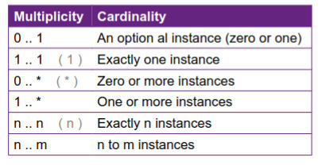

# Week 4 Relations
Association : shows a basic relationship

eg: a Company has  a worker

Unary refers to a one way where one class does not know the other class

eg: Person → Address

Binary refers to a two way where boh classes know eatchother

eg: Student → Teacher

Multiplicity: Refers to the amount of a class involved with a class

eg: patient (1) has kidney (2)

Aggregation:

class can have one of these

eg: a car has a driver

Composition:

class owns something

eg: car →<> wheel